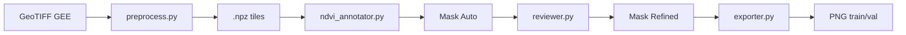

# Annotation Pipeline

Pipeline anotasi semi-otomatis untuk menghasilkan training set segmentasi U-Net.

---

## Alur



## 1. Preprocess

Membaca GeoTIFF, cloud masking, ekstraksi RGB + NIR, tiling ke ukuran tetap.

```bash
cd services/annotation-pipeline
uv run python run.py preprocess data/annotation/raw/kalimantan_2025_01_15.tif
```

Parameter (ada di `config.py`):

| Parameter | Default | Keterangan |
|-----------|---------|------------|
| `tile_size_px` | 512 | Ukuran tile dalam pixel |
| `tile_overlap_px` | 64 | Overlap antar tile |
| `cloud_threshold` | 0.3 | Max cloud fraction per scene |

Output: `.npz` files di `data/annotation/tiles/`.

## 2. Auto-Annotate (NDVI Change Detection)

Menghitung NDVI difference antara T1 dan T2, thresholding, morphological cleanup.

Dua cara:

### a. Via annotation-pipeline (512px tiles)

```bash
uv run python run.py annotate kalimantan_2025_01_15 kalimantan_2025_06_20
```

Parameter:

| Parameter | Default | Keterangan |
|-----------|---------|------------|
| `ndvi_threshold` | -0.15 | Ambang batas penurunan NDVI |
| `change_sensitivity` | 1.5 | Kernel size morph ops |

Output: `.npz` dengan mask + rgb di `data/annotation/masks_auto/`.

### b. Via scripts/generate_labels.py (64×64 chips)

Untuk dataset yang sudah di-tile 64×64:

```bash
uv run python scripts/generate_labels.py \
  --chips-dir data/training/unet/chips \
  --labels-dir data/training/unet/labels_ndvi \
  --threshold -0.15 --kernel-size 5 --min-area 64
```

Output: `.npz` mask files di `--labels-dir`.

## 3. Review & Refine (Streamlit)

Streamlit UI untuk review mask NDVI — lihat RGB, overlay, NDVI change, lalu accept/reject/refine.

```bash
uv run streamlit run services/annotation-pipeline/reviewer.py
```

### Fitur

| Fitur | Fungsi |
|-------|--------|
| **3-panel view** | RGB asli, mask overlay, NDVI change |
| **Navigation** | Prev / Next / jump ke index — + filter nama file |
| **Accept / Reject / Needs Fix** | Simpan status review per mask |
| **Threshold re-gen** | Geser slider NDVI threshold → preview langsung |
| **Pixel brush** | Canvas interaktif — Add / Erase / Toggle mode |
| **Notes** | Tiap mask bisa dikasih komentar |
| **Export** | Statistik + daftar rejected mask |

### Keyboard Shortcuts

| Tombol | Aksi |
|--------|------|
| `←` / `→` | Prev / Next |
| `A` | Accept |
| `R` | Reject |
| `F` | Needs Fix |

### Output

Review progress tersimpan otomatis di `data/training/unet/review_progress.json`.

## 4. Split Dataset

Sebelum training, split dataset ke train/val/test:

```bash
uv run python scripts/split_dataset.py \
  --chips-dir data/training/unet/chips \
  --labels-dir data/training/unet/labels_ndvi \
  --output-dir data/training/unet \
  --train-ratio 0.70 --val-ratio 0.15 --test-ratio 0.15
```

Split per-scene (stratified) untuk mencegah data leakage.

## 5. Export Training Set

Export image + mask PNG pairs siap training U-Net.

```bash
uv run python run.py export
```

Output structure:

```
data/annotation/export/masks_refined/
├── train/
│   ├── img/   # RGB PNG (512x512)
│   └── mask/  # Mask PNG (512x512, binary)
└── val/
    ├── img/
    └── mask/
```

Split: 85% train / 15% val (configurable).

## Makefile Commands

```bash
make install       # uv sync
make preprocess    # perlu SCENE=...
make annotate      # perlu T1=... T2=...
make visualize     # streamlit ui
make export        # export training set
make status        # progress report
make clean         # hapus generated files
```
