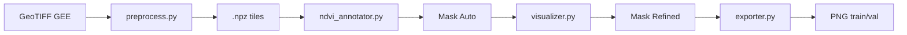

# Annotation Pipeline

Pipeline anotasi semi-otomatis untuk menghasilkan training set segmentasi U-Net.

---

## Alur



## 1. Preprocess

Membaca GeoTIFF, cloud masking, ekstraksi RGB + NIR, tiling ke ukuran tetap.

```bash
cd services/annotation-pipeline
uv run python run.py preprocess data/annotation/raw/kalimantan_2025_01_15.tif
```

Parameter (ada di `config.py`):

| Parameter | Default | Keterangan |
|-----------|---------|------------|
| `tile_size_px` | 512 | Ukuran tile dalam pixel |
| `tile_overlap_px` | 64 | Overlap antar tile |
| `cloud_threshold` | 0.3 | Max cloud fraction per scene |

Output: `.npz` files di `data/annotation/tiles/`.

## 2. Auto-Annotate (NDVI Change Detection)

Menghitung NDVI difference antara T1 dan T2, thresholding, morphological cleanup.

```bash
uv run python run.py annotate kalimantan_2025_01_15 kalimantan_2025_06_20
```

Parameter:

| Parameter | Default | Keterangan |
|-----------|---------|------------|
| `ndvi_threshold` | -0.15 | Ambang batas penurunan NDVI |
| `change_sensitivity` | 1.5 | Kernel size morph ops |

Output: `.npz` dengan mask + rgb di `data/annotation/masks_auto/`.

## 3. Visualize & Refine

Streamlit UI untuk review dan refine mask manual.

```bash
uv run streamlit run visualizer.py
```

Fitur:
- Pilih tile dari dropdown
- Lihat RGB vs overlay mask
- Add/erase area deforestasi
- Confirm mask atau skip
- Progress tracking

## 4. Export Training Set

Export image + mask PNG pairs siap training U-Net.

```bash
uv run python run.py export
```

Output structure:

```
data/annotation/export/masks_refined/
├── train/
│   ├── img/   # RGB PNG (512x512)
│   └── mask/  # Mask PNG (512x512, binary)
└── val/
    ├── img/
    └── mask/
```

Split: 85% train / 15% val (configurable).

## Makefile Commands

```bash
make install       # uv sync
make preprocess    # perlu SCENE=...
make annotate      # perlu T1=... T2=...
make visualize     # streamlit ui
make export        # export training set
make status        # progress report
make clean         # hapus generated files
```
