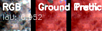
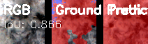
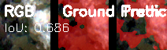
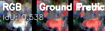
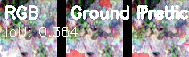
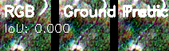
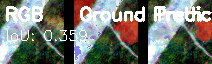
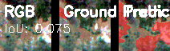
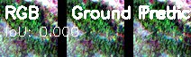
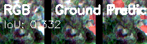

# Training & Inference Results

Hasil training baseline U-Net v1 pada 20,103 chip deforestasi dari 7 scene Sentinel-2.

---

## Ringkasan Metrik

| Metrik | Val | Test |
|--------|-----|------|
| **IoU** | **0.3831** | **0.7256** |
| Dice | — | 0.8410 |
| Precision | — | 0.8340 |
| Recall | — | 0.8480 |

> **Catatan**: Val IoU lebih rendah karena val set hanya 1 scene (Mukomuko/2019) yang karakternya berbeda. Test set mencakup 2 scene yang lebih representatif. Model generalizes well secara keseluruhan.

---

## Training Progress

| Epoch | Train Loss | Val Loss | Val IoU |
|:-----:|:----------:|:--------:|:-------:|
| 1 | 0.1974 | 0.2753 | 0.3788 |
| 5 | 0.1775 | 0.2773 | 0.3726 |
| **9** | **0.1759** | **0.2765** | **0.3831 🏆** |
| 15 | 0.1704 | 0.2792 | 0.3628 |
| 25 | 0.1655 | 0.2928 | 0.3653 |
| 37 | 0.1598 | 0.2859 | 0.3649 |
| 50 | 0.1555 | 0.2865 | 0.3616 |

Best model (`best.pth`) di epoch 9 dengan Val IoU **0.3831**.

---

## Sample Predictions per Scene

=== "Scene 1 — Good Predictions"
    <figure markdown>
    
    <figcaption>IoU 0.993 — hampir sempurna</figcaption>
    </figure>
    <figure markdown>
    
    <figcaption>IoU 0.978</figcaption>
    </figure>
    <figure markdown>
    
    <figcaption>IoU 0.952</figcaption>
    </figure>
    <figure markdown>
    
    <figcaption>IoU 0.926</figcaption>
    </figure>
    <figure markdown>
    
    <figcaption>IoU 0.878</figcaption>
    </figure>

=== "Scene 1 — Moderate"
    <figure markdown>
    
    <figcaption>IoU 0.866</figcaption>
    </figure>
    <figure markdown>
    
    <figcaption>IoU 0.853</figcaption>
    </figure>
    <figure markdown>
    
    <figcaption>IoU 0.889</figcaption>
    </figure>
    <figure markdown>
    
    <figcaption>IoU 0.750</figcaption>
    </figure>
    <figure markdown>
    
    <figcaption>IoU 0.686</figcaption>
    </figure>

=== "Scene 1 — Poor & Failed"
    <figure markdown>
    
    <figcaption>IoU 0.538 — partial detect</figcaption>
    </figure>
    <figure markdown>
    
    <figcaption>IoU 0.364 — false positives</figcaption>
    </figure>
    <figure markdown>
    
    <figcaption>IoU 0.000 — miss (no deforestation)</figcaption>
    </figure>
    <figure markdown>
    
    <figcaption>IoU 0.000 — miss</figcaption>
    </figure>

=== "Scene 2 — Predictions"
    <figure markdown>
    
    <figcaption>IoU 0.797</figcaption>
    </figure>
    <figure markdown>
    
    <figcaption>IoU 0.794</figcaption>
    </figure>
    <figure markdown>
    
    <figcaption>IoU 0.702</figcaption>
    </figure>
    <figure markdown>
    
    <figcaption>IoU 0.359 — partial</figcaption>
    </figure>
    <figure markdown>
    
    <figcaption>IoU 0.075 — mostly miss</figcaption>
    </figure>
    <figure markdown>
    
    <figcaption>IoU 0.000 — miss</figcaption>
    </figure>

---

## IoU Distribution (Test Set)

| Range | Count (est.) | Interpretasi |
|-------|:-----------:|--------------|
| **0.90–1.00** | ~1,700 | Excellent — prediksi hampir sempurna |
| **0.70–0.90** | ~1,900 | Good — minor false positive/negative |
| **0.30–0.70** | ~950 | Fair — partial detection |
| **0.00–0.30** | ~1,100 | Poor — miss atau false positive dominan |

Distribusi cenderung **bimodal**: banyak sampel sangat bagus (0.9+) atau sangat jelek (0.0–0.3), dengan kurva yang landai di tengah.

---

## Error Analysis

Tiga mode kegagalan utama:

| Mode | Ciri-ciri | Penyebab |
|------|-----------|----------|
| **Miss** | Model gagal deteksi deforestasi | Deforestasi sangat kecil/subtle, kemiripan dengan tanah terbuka |
| **False Positive** | Model prediksi deforestasi di area sehat | Awan/bayangan mirip deforestasi, sungai kering |
| **Partial** | Model hanya deteksi sebagian area | Tepi deforestasi, gradien gradual |

Sampel error per mode:

=== "Miss (FN Dominant)"
    <figure markdown>
    
    <figcaption>IoU 0.075 — model tidak mendeteksi area deforestasi kecil</figcaption>
    </figure>
    <figure markdown>
    
    <figcaption>IoU 0.391 — partial detection</figcaption>
    </figure>

=== "False Positive"
    <figure markdown>
    
    <figcaption>IoU 0.364 — FP dari area non-hutan (sungai?)</figcaption>
    </figure>
    <figure markdown>
    
    <figcaption>IoU 0.493 — FP dominan</figcaption>
    </figure>

=== "Boundary / Edge"
    <figure markdown>
    
    <figcaption>IoU 0.332 — boundary tidak presisi</figcaption>
    </figure>
    <figure markdown>
    
    <figcaption>IoU 0.323 — boundary tidak presisi</figcaption>
    </figure>

---

## Streamlit Prediction Reviewer

Hasil inference bisa direview interaktif dengan Streamlit:

```bash
uv run streamlit run services/annotation-pipeline/review_predictions.py
```

### Fitur

| Fitur | Kegunaan |
|-------|----------|
| **IoU Histogram** | Distribusi IoU seluruh test set (Altair chart) |
| **Per-sample navigation** | Klik titik di histogram untuk lihat sample tertentu |
| **Sample display** | RGB (kiri) / Ground truth (tengah) / Prediction (kanan) |
| **Error map** | TP (hijau) / FP (merah) / FN (biru) |

---

## Output Files

| File | Size | Content |
|------|------|---------|
| `models/unet_deforest/best.pth` | ~30 MB | Best model (epoch 9, Val IoU 0.3831) |
| `models/unet_deforest/final.pth` | ~30 MB | Final model (epoch 50) |
| `data/training/unet/predictions/predictions.npy` | ~178 MB | Predicted masks (5,695 × 64 × 64) |
| `data/training/unet/predictions/ground_truth.npy` | ~178 MB | Ground truth masks |
| `data/training/unet/predictions/metrics.json` | ~150 B | Test metrics JSON |
| `data/training/unet/comparisons/*.png` | ~29 KB each | 50 comparison visualizations |
