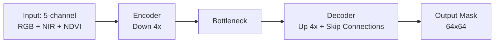

# Training Pipeline

U-Net training pipeline untuk segmentasi deforestasi.

---

## Arsitektur Model



| Komponen | Detail |
|----------|--------|
| Input | 5 channel: RGB (3) + NIR (1) + NDVI (1) |
| Encoder | 4 stage down-sampling, base filters=32 |
| Bottleneck | 512 filters |
| Decoder | 4 stage up-sampling + skip connections |
| Output | 2 channel (forest / deforest) |
| Total params | ~7.5M |

## Quick Start

```bash
uv pip install -r scripts/requirements-training.txt

# Train
uv run python scripts/train_unet.py \
  --manifest data/training/unet/manifest.json \
  --output models/unet_deforest \
  --epochs 50 \
  --batch-size 32 \
  --lr 1e-3

# Infer
uv run python scripts/infer_unet.py \
  --manifest data/training/unet/manifest.json \
  --model models/unet_deforest/best.pth \
  --output data/training/unet/predictions

# Visualize
uv run python scripts/compare_viz.py \
  --manifest data/training/unet/manifest.json \
  --predictions data/training/unet/predictions/predictions.npy \
  --output data/training/unet/comparisons \
  --num-samples 50

# Review (Streamlit)
uv run streamlit run services/annotation-pipeline/review_predictions.py
```

## Training Results (v1 — baseline)

### Dataset Split

| Split | Samples | Scenes |
|-------|---------|--------|
| Train | 11,500 | 4 scenes |
| Val   | 2,908  | Mukomuko/2019 |
| Test  | 5,695  | 2 scenes |
| **Total** | **20,103** | **7 unique scenes** |

### Training Log (Epoch Progression)

```
Epoch   1/50 | Train Loss: 0.1974 | Val Loss: 0.2753 | Val IoU: 0.3788  ← best saved
Epoch   5/50 | Train Loss: 0.1775 | Val Loss: 0.2773 | Val IoU: 0.3726
Epoch   9/50 | Train Loss: 0.1759 | Val Loss: 0.2765 | Val IoU: 0.3831  ← BEST
Epoch  10/50 | Train Loss: 0.1753 | Val Loss: 0.2836 | Val IoU: 0.3712
Epoch  15/50 | Train Loss: 0.1704 | Val Loss: 0.2792 | Val IoU: 0.3628
Epoch  20/50 | Train Loss: 0.1670 | Val Loss: 0.2814 | Val IoU: 0.3636
Epoch  25/50 | Train Loss: 0.1655 | Val Loss: 0.2928 | Val IoU: 0.3653
Epoch  30/50 | Train Loss: 0.1631 | Val Loss: 0.2877 | Val IoU: 0.3628
Epoch  37/50 | Train Loss: 0.1598 | Val Loss: 0.2859 | Val IoU: 0.3649
Epoch  42/50 | Train Loss: 0.1565 | Val Loss: 0.2819 | Val IoU: 0.3663
Epoch  50/50 | Train Loss: 0.1555 | Val Loss: 0.2865 | Val IoU: 0.3616
```

### Test Set Performance

| Metrik | Value |
|--------|-------|
| **IoU** | **0.7256** |
| Dice | 0.8410 |
| Precision | 0.8340 |
| Recall | 0.8480 |

> **Catatan**: Test IoU (0.73) lebih tinggi dari Val IoU (0.38) karena split tersebar per scene. Scene val (Mukomuko/2019) memiliki karakteristik lebih sulit. Test set mencakup 2 scene yang lebih representatif.

### Loss Function

**Dice Loss** — dengan ignore index 255 untuk cloud:

```python
class DiceLoss(nn.Module):
    def forward(self, logits, targets):
        # Ignore class 255 (cloud regions)
        # Dice = 1 - (2*|A∩B| + smooth) / (|A| + |B| + smooth)
```

### Hyperparameters

| Parameter | Value | Notes |
|-----------|-------|-------|
| Epochs | 50 | Cosine annealing from 1e-3 → 0 |
| Batch size | 32 | 360 iter/train, 91 iter/val |
| Learning rate | 1e-3 → 0 | CosineAnnealingLR |
| Optimizer | AdamW | weight_decay=1e-4 |
| Input size | 64×64 | 5 channels |
| Data loader | num_workers=0 | WSL C-drive compatibility |

### Key Decisions

| Issue | Solution |
|-------|----------|
| NaN loss (raw NIR 1952-5520) | Normalize NIR via `/ 10000.0` |
| Corrupted chip (NaN pixels) | `np.nan_to_num` fallback to 0 |
| WSL DataLoader hang | `num_workers=0` (sequential loading) |
| Apple Double files (._\*) | Clean via `find ... -name '._*' -delete` |
| Cloud masking | RGB heuristic (brightness >180 + blue-shifted + low NDVI) |

## Monitoring

Training log di `models/unet_deforest/train.log`:

```
Epoch   1/50 | Train Loss: 0.1974 | Val Loss: 0.2753 | Val IoU (deforest): 0.3788 | LR: 9.99e-04
  → New best model saved (IoU: 0.3788)
...
Epoch  50/50 | Train Loss: 0.1555 | Val Loss: 0.2865 | Val IoU (deforest): 0.3616 | LR: 0.00e+00
Done. Best IoU: 0.3831
Model saved to models/unet_deforest
```

Best model (`best.pth`) dan final model (`final.pth`) tersimpan di `models/unet_deforest/`.

## Inference

```python
import torch
from train_unet import SimpleUNet

model = SimpleUNet(in_channels=5, out_channels=2)
model.load_state_dict(torch.load("models/unet_deforest/best.pth"))
model.eval()

# Input: (B, 5, 64, 64) — RGB + NIR + NDVI
with torch.no_grad():
    logits = model(chip_batch)
    mask = logits.argmax(dim=1)  # 0=forest, 1=deforest
```

Lihat [scripts/infer_unet.py](https://github.com/FarrelGhozy/Deforest.id/blob/main/scripts/infer_unet.py) untuk full pipeline inference.
